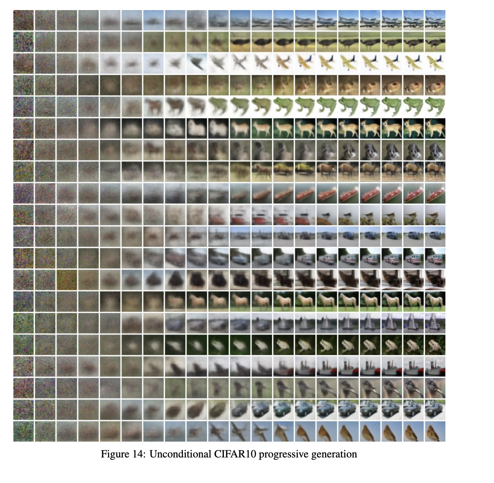
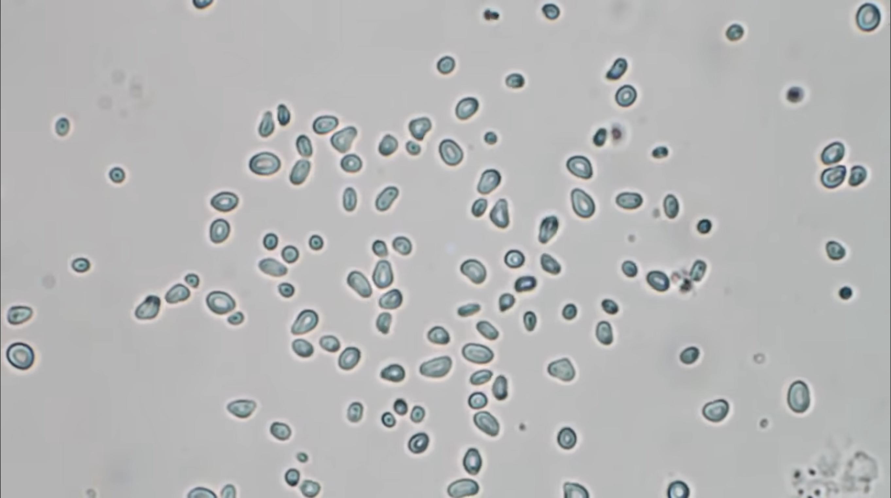
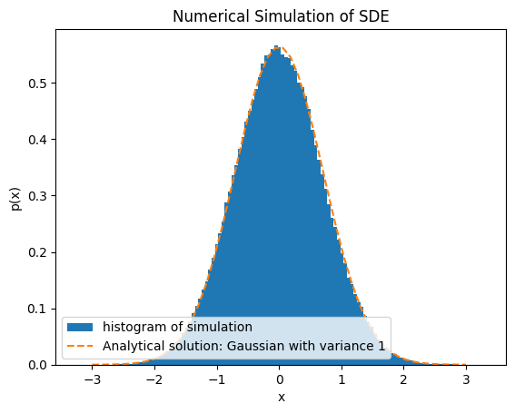

# Brownian Motion - The Math Behind Generative AI and Diffusion

## Diffusion and AI Models

So how do those AI image generation things work?

While I'm no expert, from perusing through some of the foundational papers (see [references](#references)) it seems to rely on adding and removing noise or randomness to images and learning to reverse the process. 

Essentially, you start with an image, add a little noise to it, then train a neural network to remove the noise. Then add a little more noise and train the network to remove that noise. If you keep doing this, you're eventually left with just noise. You can then start with just noise and reverse the process and *magically* end up with a new image!



Figure 1: Generating images from noise ([Ho et. al, 2020](https://arxiv.org/pdf/2006.11239)).

When looking through this paper, and some others, it quickly became clear that understanding stochastic (random) processes was very important. Phrases like "stochastic differential equations", "Brownian motion", and "Fokker Planck equations" kept coming up and I didn't know too much about these.

I came across [this](https://arxiv.org/abs/cond-mat/0701242) (Garcia-Palacios, 2007) set of notes, which helped clarify a lot of concepts, so I wanted to present some of them here with some of my own explanations.

So let's get started, right at the beginning, with [Robert Brown](https://en.wikipedia.org/wiki/Robert_Brown_(botanist,_born_1773)).

## Brownian Motion

### Dancing Particles

Back in the 1800s, botanist Robert Brown was looking at pollen grains in a glass of water and found something surprising. They were moving around. Endlessly. They weren't just floating in place, but kind of bouncing around erratically and randomly.

You can see a demo of this experiment [here](https://youtu.be/R5t-oA796to?si=9F8TcGfodbPwynII&t=15).



Figure 2: Pollen particles suspended in water.


Oddly, despite the particles not touching, they have a random motion to this.

### Famous Scientist to the Rescue

It would take about 100 years before this mystery was figure out, by none other than Albert Einstein himself. You can see his original paper [here](https://www2.math.uconn.edu/~gordina/Einstein_Brownian1905.pdf) (Einstein, 1905).

He imagined each particle taking a random step (or walk) $\Delta$ at every instant of time. This could be in any direction, up, down, left, right... etc, but for simplicity, let's imagine this in 1D, so just left or right.

On average the particle stays in place, but there's a small chance it moves a small step left or right, with a larger step being less probable. Left and right steps are equally likely, so we could write a probabilty distribution on the steps:

$$\phi(\Delta) = \phi(-\Delta)$$

This could like like a Gaussian, but any zero centered, symmetric distribution would do.

We would also want to know how many particles $n(x)$ are around a given location $dx$. 

This should be given by the total number of particles $N$ times the probabilty $p(x)$ of finding a particle in that area $dx$.

$$ n(x)dx = N p(x) dx $$

The next step is to know how these particles move around. We can imagine particles start in an initial location $x$ and then taking a step $\Delta$ to the new location $x + \Delta$, and asking how often this happens.

We can write this as the number of particles at our location at the next time step: $n(x, t+\tau)$

is the number that moved from $x+\Delta$ to $x$ with a step $-\Delta$: $n(x+\Delta) \phi(-\Delta)$

We can make this nicer, by noting that $\phi$ is symmetric, so $\phi(-\Delta) = \phi(\Delta)$.

We should account for any $\Delta$, so integrate the right hand side over all delta.

This leaves us with:

$$ n(x, t + \tau) = \int_{-\infty}^{\infty} n(x+\Delta, t) \phi(\Delta)d\Delta $$

For a small time step, we can expand the right hand side as:

$$ n(x, t + \tau) \approx n(x, t) +\tau\frac{\partial n}{dt} $$

We can similiar do the right hand side for a small $\Delta$:

$$n(x + \Delta, t) \approx n(x, t) + \Delta\frac{\partial n}{\partial x} + \frac{\Delta^2}{2}\frac{\partial^2n}{\partial x^2} $$

Our equation becomes:

$$  n(x, t) +\tau\frac{\partial n}{\partial t} = \int_{-\infty}^{\infty}\left(n(x, t) \phi(\Delta) + \Delta\frac{\partial^2n}{\partial x^2} \phi(\Delta) + \frac{\Delta^2}{2}\frac{\partial^2n}{\partial x^2}\phi(\Delta)  \right)d\Delta$$

To integrate these, we can use:

- the probability distribution sums/integrates to 1.

$$ \int \phi(\Delta) d\Delta = 1 $$

- it is symmetric, so odd integrals are zero, and even are non-zero:

$$ \int \Delta \phi(\Delta) d\Delta = 0$$

$$ \int \Delta^2 \phi(\Delta) d\Delta \neq 0 $$

This is why we expanded the right hand side to second order, because to first order, we don't learn anything.

Define: 

$$D = \frac{1}{\tau}\int^\infty_{-\infty} \frac{\Delta^2}{2}\phi(\Delta) d\Delta$$

This gives us:

$$  n(x, t) +\tau\frac{\partial n}{dt} = n(x, t)  + 0 + \tau D\frac{\partial^2n}{\partial x^2}  $$
$$ \frac{\partial n}{dt} =  D\frac{\partial^2n}{\partial x^2}  $$

Which is the heat equation!

$$ \frac{\partial u}{\partial t} = \alpha\frac{d^2u}{dx^2} $$

The heat equation describes how heat spreads out in a material. You can imagine adding hot water to a ceramic mug and asking how the mug heats up - the heat equation tells you this. 

It is a diffusion equation, which means areas of high concentration (of heat or otherwise) spread out into the cooler areas, to bring the system to a uniform density (temperature).

The $D$ we defined earlier is known as the diffusion constant. This hopefully follows some intuition of putting a concentration of randomly moving particles at one place; we might expect they spread out over time as their random walks (diffusion) moves them from high concentration to low.

**An important note:**

The diffusion constant tells us something a little surprising about the movement of the particles. Look at its units:

$\tau$ is time, $\Delta^2$ is distance squared, and $\phi(\Delta)$ is unitless (just a probability distribution). So imagine our particle takes a step $\Delta$, and we want to know what time scale this takes place. Well:

$$ D =\Delta^2 / \tau \sim \mathrm{distance^2} / \mathrm{time} $$

$$ \Delta = \sqrt{D\tau} $$

This means our random force happens over the time scale of the square root of our time step! So if we want to look at a first order effect in time for a random force, its second order in $\Delta$ ($\Delta^2$ gives us an effect of order $\tau$)! This also helps justify our second order expansion of the right hand side with $\Delta$ compared to first order expansion on the right hand side of $\tau$.

This is an important result for working with random forces. It means to look at a first order effect in time, is a second order effect for the random forces displacement.

Said another way, to understand how a random force moves a particle, we must look at the square of its displacement to get the average moving force.

Often random forces are zero mean, meaning on average the particle stays in place. However the square of the displacement is nonzero, and proportional to the characteristic time. Writing a random force as $dW$ (I believe W is for [Wiener](https://en.wikipedia.org/wiki/Norbert_Wiener), another scientist who formalized this theory).

Let's run a simulation to see this effect.

## Examples

### Example 1: A damped particle with a random force

Consider a particle with a unit (1) damping force and a random force $\eta$. We would write it's stochastic differential equation as:

$$ \dot x = - x + \eta$$

Except noise isn't really differentiable, so it makes more sense to write this in a discrete manner:

$$ \frac{dx}{dt} \approx (x_{n+1} - x_n)/dt = -x_n + \eta$$

$$ x_{n+1} - x_n = -x_n dt + dt \,\eta$$

If we identify $x_{n+1} - x_n$ as $dx$ and $dt \,\eta$ as $dW$ this is the standard form of stochastic differential equations (SDEs):

$$ dx = ax + b\,dW$$

where $a$ is a some scalar, and b is the intensity of the noise increment $dW$

This tells us the algorithm to simulate:

```python
dt = .001 # some time increment we choose
x = 0 # set some initial condition

for some number of loops:
    dW = normal(0, 1) * sqrt(dt) # get a random number with zero mean and variance dt
    dx = -x * dt + dW # do the time step
    x = x + dx # increment our variable
```

What should we expect to happen here?

Well the damping should force the particle to be centered at $x=0$, and the random force should wiggle it around at that point. If we then take a histogram of the particles position over time, we should see its a Gaussian centered at zero with variance dt.

Mathematically, we have:

$$ \braket{dW} = 0, \braket{dW^2} = dt$$

$$  dx = - x \,dt+ dW$$

In steady state, our particle on average isn't moving, so $dx=0$

$$\braket{dx} = 0 = -dt\braket{x} + \braket{dW}= -dt\braket{x} + 0 = 0 \implies \braket{x} = 0$$

So on average $x=0$.

What about the variance or spread of $x$?

$$ \braket{dx^2} = \braket{(-x \,dt+ dW)^2} = \braket{x^2 dt^2 - 2 x dt\,dW + dW^2} $$

The $dt^2$ term is higher than order one so we neglect.

The $dt\,dW$ is also higher than order $dt$, since $dW$ is of order $\sqrt{dt}$, so $dt\,dW \sim dt^{3/2}$.

Leaving us with:

$$ \braket{dx^2} = \braket{dW^2} = dt = \braket{x_{n+1}^2 - 2x_{n+1}x_n + x_n^2} $$

Use $x_{n+1} = x_n - x_n dt + dW$, so:

$$\braket{x_{n+1}x_n} = \braket{x_n^2 - x_n^2 dt + x_n dW} $$

$x_n$ and $dW$ aren't correlated at the same time step (only with the next time step), so:

$$\braket{x_n^2 - x_n^2 dt + x_n dW} = (1-dt) \braket{x_n^2} + 0$$

Then: 

$$ \braket{dx^2} = dt = \braket{x_{n+1}^2} + \braket{x_n^2} - 2(1-dt)\braket{x_n^2} $$

In steady state the $\braket{x_{n+1}^2} = \braket{x_n^2}$, meaning the variance is not changing, so:

$$ dt = 2\braket{x_{n}^2} - 2\braket{x_n^2} + dt \braket{x_n^2} $$

Resulting in (meaning in steady state):

$$ \braket{x^2} = 1$$

Which is exactly what our simulation gives us! A histogram of samples centered at 0 and with variance 1.



[Code](./plots.ipynb) for simulation.

---

Where $\eta$ is a random force on it zero mean and $\tau$ (or $dt$) variance.

$$\braket{\eta} = 0, \braket{\eta^2} = dt$$
We could write it as a force sampled from a Gaussian (normal distribution), with 0 mean and standard deviation (square root of variance) $\sqrt{dt}$:

$$ \eta \sim N(0, \sqrt{dt}) = \sqrt{dt} N(0,1)$$

To simulate this we can do a simple time integration scheme:

$$ \frac{dx}{dt} \approx (x_{n+1} - x_n)/dt = -x_n + \eta$$

$$ x_{n+1} - x_n = -x_n dt + dt \,\eta$$

$$ $$


### References

